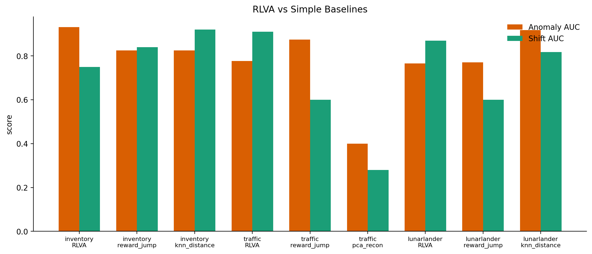
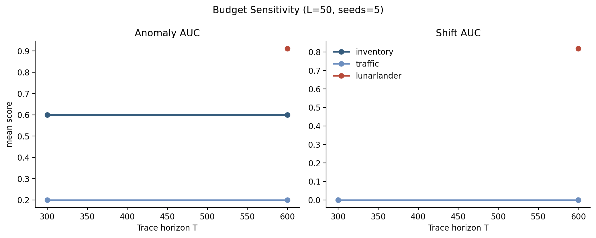
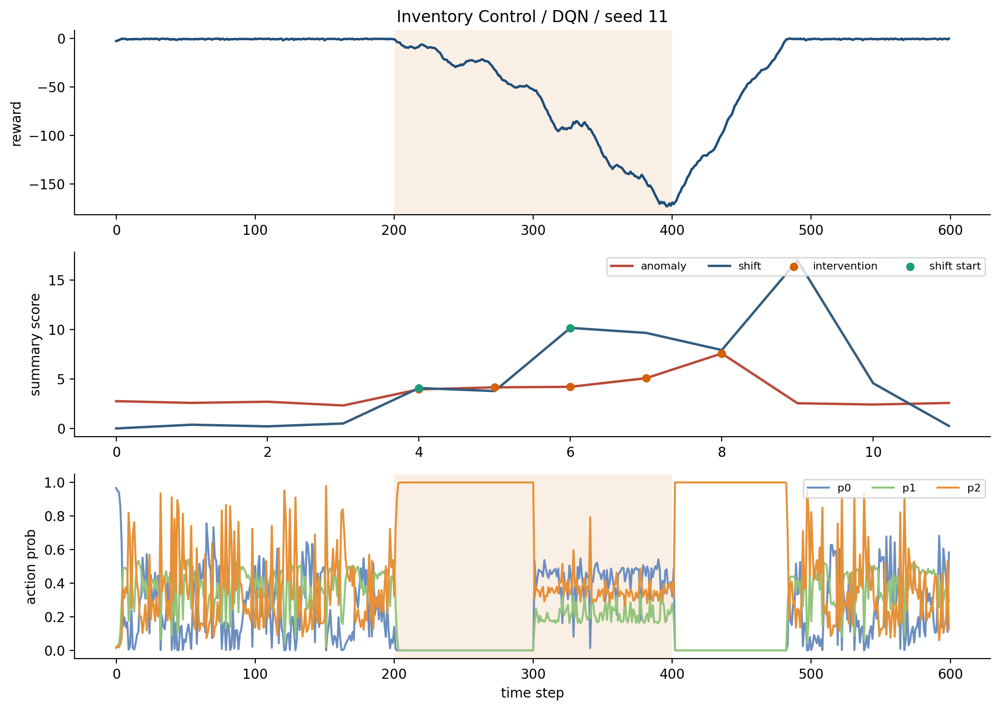
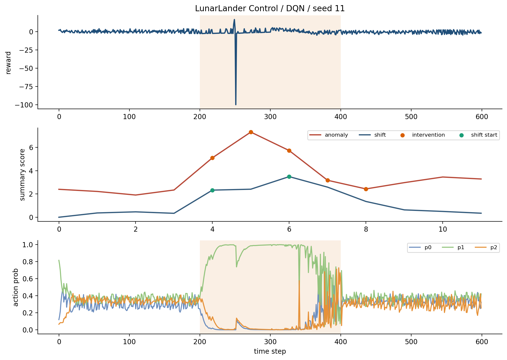
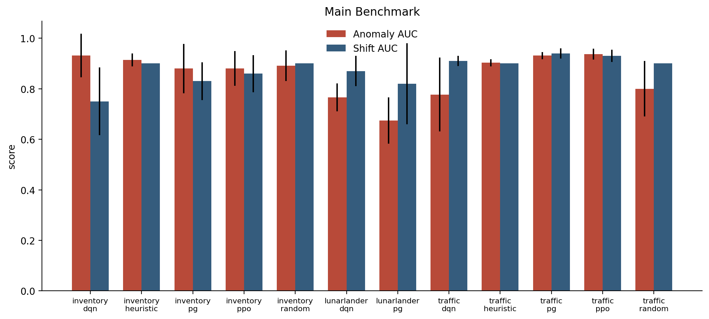
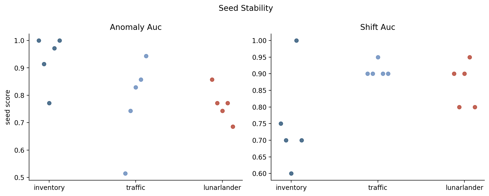
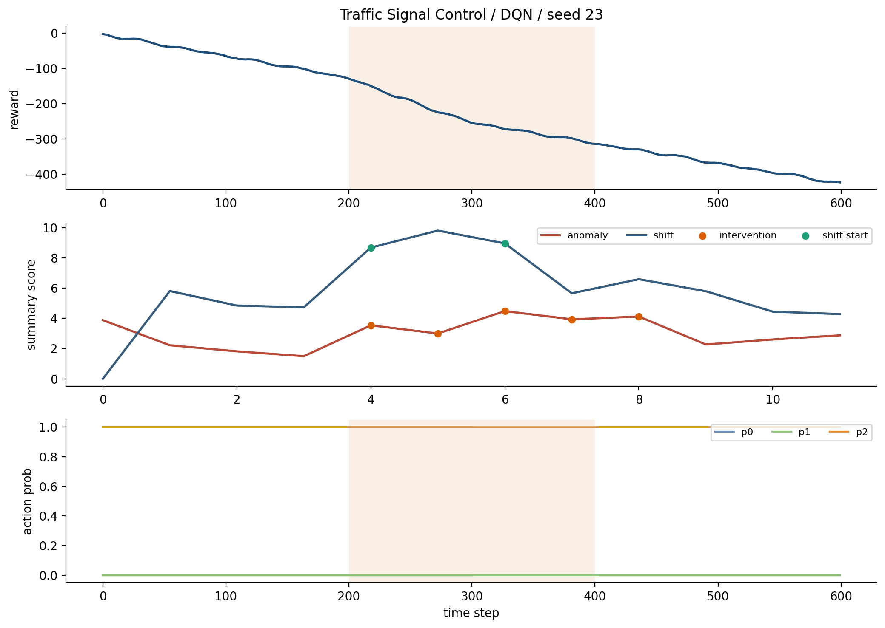

# Course Evidence Report

This static report replaces the former in-app Course Evidence Workspace. The Streamlit application now stays focused on the final user-facing product, while this document preserves the grading evidence as text, tables, and embedded images.

## Course Rubric Mapping

- Value of extracted information: the dashboard helps users across traffic, inventory, queueing, control QA, and robotics safety isolate risky windows, confirm operating changes, compare controllers, and export action-ready memos.
- Methods and models: RLVA combines seeded trace generation, window-level summarization, anomaly scoring, shift localization, clustering, controller comparison, baseline comparison, ablation, and robustness checks.
- Final application interactivity: every main chart is clickable and links filters, ranked windows, behavior maps, timelines, comparison views, case notes, task logs, and exports.
- This report holds the course-facing evidence so the product interface is not cluttered with developer or instructor-only screens.

## Dataset Layer

- Benchmark trace files: 125.
- Benchmark summary files: 125.
- Processed trace records: 75000.
- Processed summary windows: 1500.
- Benchmark trace storage footprint: 14.43 MB.
- Course-scale raw dataset: `rlva/outputs/course_dataset/rlva_trace_corpus_close_to_1gb.csv.gz`.
- Course-scale raw records: 4203600.
- Course-scale raw size: 972.75 MB.
- Delivery format: split gzip archive parts committed to GitHub and reassembled locally at runtime.
- Provenance: Synthetic large raw trace corpus generated from seeded RLVA benchmark traces with provenance columns preserved..

## Trust Question 1: Does It Catch Unusual Behavior?

The course workspace answered this with benchmark rankings, unusual-behavior scores, baseline comparisons, and example cases. The user-facing dashboard uses the same evidence in the risk matrix and priority queue.

- Best anomaly result: `traffic` / `ppo` with anomaly AUC 0.937 +/- 0.021.

### Top Benchmark Rows

| Environment | Policy | Anomaly AUC | Shift AUC | Reward-Jump AUC | Shift Localization Error |
| --- | --- | --- | --- | --- | --- |
| traffic | ppo | 0.937 +/- 0.021 | 0.930 +/- 0.024 | 0.900 +/- 0.000 | 0.400 +/- 0.490 |
| traffic | pg | 0.931 +/- 0.014 | 0.940 +/- 0.020 | 0.900 +/- 0.000 | 0.200 +/- 0.400 |
| inventory | dqn | 0.931 +/- 0.086 | 0.750 +/- 0.134 | 0.700 +/- 0.126 | 2.400 +/- 1.200 |
| inventory | heuristic | 0.914 +/- 0.026 | 0.900 +/- 0.000 | 0.900 +/- 0.000 | 1.000 +/- 0.000 |
| traffic | heuristic | 0.903 +/- 0.014 | 0.900 +/- 0.000 | 0.900 +/- 0.000 | 1.000 +/- 0.000 |
| inventory | random | 0.891 +/- 0.061 | 0.900 +/- 0.000 | 0.900 +/- 0.000 | 1.000 +/- 0.000 |
| inventory | ppo | 0.880 +/- 0.069 | 0.860 +/- 0.073 | 0.770 +/- 0.163 | 0.600 +/- 0.490 |
| inventory | pg | 0.880 +/- 0.098 | 0.830 +/- 0.075 | 0.800 +/- 0.071 | 1.400 +/- 0.800 |
| traffic | random | 0.800 +/- 0.110 | 0.900 +/- 0.000 | 0.900 +/- 0.000 | 1.000 +/- 0.000 |
| traffic | dqn | 0.777 +/- 0.146 | 0.910 +/- 0.020 | 0.900 +/- 0.000 | 0.800 +/- 0.400 |

### Baseline Comparison Evidence

| Method | Environment | Policy | Anomaly AUC | Shift AUC | Localization Error |
| --- | --- | --- | --- | --- | --- |
| reward_jump | inventory | heuristic | 0.975 +/- 0.050 | 1.000 +/- 0.000 | 0.000 +/- 0.000 |
| knn_distance | lunarlander | dqn | 0.919 +/- 0.064 | 0.818 +/- 0.276 | 2.200 +/- 1.833 |
| reward_jump | traffic | random | 0.900 +/- 0.050 | 0.640 +/- 0.080 | 1.000 +/- 0.000 |
| reward_jump | traffic | heuristic | 0.900 +/- 0.050 | 0.640 +/- 0.080 | 1.000 +/- 0.000 |
| reward_jump | traffic | ppo | 0.875 +/- 0.079 | 0.600 +/- 0.126 | 1.000 +/- 0.000 |
| reward_jump | traffic | pg | 0.875 +/- 0.079 | 0.600 +/- 0.126 | 1.000 +/- 0.000 |
| reward_jump | inventory | ppo | 0.875 +/- 0.112 | 0.880 +/- 0.160 | 0.400 +/- 0.490 |
| reward_jump | traffic | dqn | 0.875 +/- 0.079 | 0.600 +/- 0.126 | 1.000 +/- 0.000 |
| pca_recon | queue | dqn | 0.850 +/- 0.094 | 0.840 +/- 0.233 | 0.800 +/- 1.166 |
| knn_distance | inventory | dqn | 0.825 +/- 0.061 | 0.920 +/- 0.098 | 0.400 +/- 0.490 |
| reward_jump | inventory | dqn | 0.825 +/- 0.218 | 0.840 +/- 0.150 | 0.600 +/- 0.490 |
| mahalanobis | inventory | pg | 0.825 +/- 0.127 | 0.640 +/- 0.196 | 2.400 +/- 0.800 |

## Trust Question 2: Does It Catch Operating Changes?

The former workspace emphasized shift AUC, localization error, sensitivity to time-window settings, and qualitative case studies. This evidence supports the dashboard's change-confidence timeline.

- Best shift result: `traffic` / `pg` with shift AUC 0.940 +/- 0.020.
- Best localization result: `traffic` / `pg` with localization error 0.200 +/- 0.400.

### Detection Snapshot

| Environment | Policy | Anomaly AUC | Shift AUC | Reward-Jump AUC |
| --- | --- | --- | --- | --- |
| cartpole | dqn | 0.577 | 0.618 | 0.466 |
| cartpole | heuristic | 0.543 | 0.568 | 0.411 |
| cartpole | pg | 0.583 | 0.570 | 0.457 |
| cartpole | ppo | 0.474 | 0.526 | 0.388 |
| cartpole | random | 0.591 | 0.644 | 0.533 |
| inventory | dqn | 0.934 | 0.738 | 0.694 |
| inventory | heuristic | 0.917 | 0.900 | 0.820 |
| inventory | pg | 0.879 | 0.848 | 0.798 |
| inventory | ppo | 0.893 | 0.876 | 0.776 |
| inventory | random | 0.897 | 0.900 | 0.820 |
| lunarlander | dqn | 0.797 | 0.886 | 0.712 |
| lunarlander | heuristic | 0.719 | 0.742 | 0.600 |

### Budget Sensitivity

| Environment | Policy | Trace Horizon | Window Length | Seeds | Shift AUC | Localization Error |
| --- | --- | --- | --- | --- | --- | --- |
| lunarlander | dqn | 600 | 100 | 3 | 1.000 +/- 0.000 | 0.000 +/- 0.000 |
| lunarlander | dqn | 600 | 100 | 1 | 1.000 +/- 0.000 | 0.000 +/- 0.000 |
| traffic | dqn | 300 | 25 | 1 | 1.000 +/- 0.000 | 0.000 +/- 0.000 |
| traffic | dqn | 300 | 25 | 3 | 1.000 +/- 0.000 | 0.000 +/- 0.000 |
| traffic | dqn | 600 | 25 | 3 | 1.000 +/- 0.000 | 0.000 +/- 0.000 |
| traffic | dqn | 600 | 25 | 1 | 1.000 +/- 0.000 | 0.000 +/- 0.000 |
| lunarlander | dqn | 600 | 100 | 5 | 0.960 +/- 0.080 | 0.200 +/- 0.400 |
| traffic | dqn | 300 | 25 | 5 | 0.900 +/- 0.200 | 0.200 +/- 0.400 |
| traffic | dqn | 600 | 25 | 5 | 0.900 +/- 0.200 | 0.200 +/- 0.400 |
| lunarlander | dqn | 600 | 50 | 5 | 0.818 +/- 0.129 | 2.000 +/- 1.095 |
| lunarlander | dqn | 600 | 25 | 3 | 0.797 +/- 0.054 | 5.333 +/- 2.055 |
| lunarlander | dqn | 600 | 25 | 1 | 0.739 +/- 0.000 | 8.000 +/- 0.000 |

## Trust Question 3: Does It Stay Reliable And Responsive?

The course workspace grouped seed stability, robustness checks, interaction latency, and user-task metrics here. Those numbers are preserved below.

### Repeated-Run Stability

| Environment | Policy | Seed | Anomaly AUC | Shift AUC | Reward-Jump AUC |
| --- | --- | --- | --- | --- | --- |
| inventory | pg | 17 | 1.000 | 0.900 | 0.900 |
| inventory | random | 19 | 1.000 | 0.900 | 0.900 |
| inventory | pg | 11 | 1.000 | 0.700 | 0.700 |
| inventory | dqn | 23 | 1.000 | 0.700 | 0.650 |
| inventory | dqn | 11 | 1.000 | 0.750 | 0.650 |
| inventory | dqn | 19 | 0.971 | 1.000 | 0.950 |
| traffic | ppo | 11 | 0.971 | 0.900 | 0.900 |
| traffic | ppo | 13 | 0.943 | 0.950 | 0.900 |
| inventory | heuristic | 19 | 0.943 | 0.900 | 0.900 |
| lunarlander | ppo | 11 | 0.943 | 0.700 | 0.500 |
| inventory | heuristic | 11 | 0.943 | 0.900 | 0.900 |
| traffic | pg | 11 | 0.943 | 0.900 | 0.900 |

### Feature-Ablation Evidence

| Environment | Policy | Best Feature Group | Anomaly AUC | Shift AUC |
| --- | --- | --- | --- | --- |
| cartpole | dqn | state_action | 0.646 +/- 0.108 | 0.710 +/- 0.086 |
| cartpole | heuristic | state_action | 0.566 +/- 0.108 | 0.620 +/- 0.172 |
| cartpole | pg | state_only | 0.606 +/- 0.137 | 0.670 +/- 0.103 |
| cartpole | ppo | state_only | 0.543 +/- 0.139 | 0.550 +/- 0.114 |
| cartpole | random | no_switch_rate | 0.606 +/- 0.111 | 0.630 +/- 0.201 |
| inventory | dqn | state_action | 0.977 +/- 0.033 | 0.750 +/- 0.134 |
| inventory | heuristic | full | 0.914 +/- 0.026 | 0.900 +/- 0.000 |
| inventory | pg | state_only | 0.880 +/- 0.075 | 0.810 +/- 0.066 |
| inventory | ppo | reward_only | 0.897 +/- 0.082 | 0.840 +/- 0.058 |
| inventory | random | no_switch_rate | 0.903 +/- 0.062 | 0.900 +/- 0.000 |
| lunarlander | dqn | no_switch_rate | 0.783 +/- 0.039 | 0.850 +/- 0.063 |
| lunarlander | heuristic | full | 0.709 +/- 0.100 | 0.720 +/- 0.186 |
| lunarlander | pg | full | 0.674 +/- 0.091 | 0.820 +/- 0.160 |
| lunarlander | ppo | no_switch_rate | 0.771 +/- 0.167 | 0.710 +/- 0.150 |
| lunarlander | random | state_only | 0.691 +/- 0.199 | 0.740 +/- 0.146 |

### Window-Length Robustness

| Environment | Policy | Window Length | Shift AUC | Shift Hit@3 |
| --- | --- | --- | --- | --- |
| lunarlander | pg | 75 | 0.533 +/- 0.239 | 1.000 +/- 0.000 |
| queue | dqn | 50 | 0.540 +/- 0.102 | 1.000 +/- 0.000 |
| queue | ppo | 75 | 0.483 +/- 0.133 | 1.000 +/- 0.000 |
| queue | ppo | 50 | 0.430 +/- 0.117 | 1.000 +/- 0.000 |
| queue | pg | 100 | 0.325 +/- 0.100 | 1.000 +/- 0.000 |
| queue | pg | 75 | 0.417 +/- 0.075 | 1.000 +/- 0.000 |
| queue | heuristic | 100 | 0.250 +/- 0.000 | 1.000 +/- 0.000 |
| queue | heuristic | 75 | 0.350 +/- 0.033 | 1.000 +/- 0.000 |
| queue | dqn | 100 | 0.475 +/- 0.050 | 1.000 +/- 0.000 |
| queue | dqn | 75 | 0.433 +/- 0.097 | 1.000 +/- 0.000 |
| lunarlander | random | 100 | 0.650 +/- 0.094 | 1.000 +/- 0.000 |
| queue | random | 75 | 0.467 +/- 0.085 | 1.000 +/- 0.000 |

### Behavior-Group Robustness

| Environment | Policy Pair | Clusters | Top JS Divergence |
| --- | --- | --- | --- |
| traffic | heuristic vs pg | 8 | 0.688 +/- 0.011 |
| traffic | dqn vs pg | 8 | 0.683 +/- 0.020 |
| traffic | heuristic vs pg | 12 | 0.683 +/- 0.020 |
| traffic | heuristic vs pg | 16 | 0.683 +/- 0.020 |
| traffic | heuristic vs pg | 4 | 0.680 +/- 0.019 |
| traffic | dqn vs pg | 4 | 0.661 +/- 0.045 |
| cartpole | dqn vs heuristic | 4 | 0.578 +/- 0.166 |
| cartpole | dqn vs heuristic | 8 | 0.578 +/- 0.166 |
| cartpole | dqn vs heuristic | 12 | 0.578 +/- 0.166 |
| cartpole | dqn vs heuristic | 16 | 0.578 +/- 0.166 |
| queue | dqn vs heuristic | 4 | 0.560 +/- 0.266 |
| queue | dqn vs heuristic | 12 | 0.555 +/- 0.277 |

### Interaction Performance

- Backend weighted throughput: 433,333 records per second.
- Backend peak throughput: 439,024 records per second.
- Front-end median response: 86.8 ms.
- Front-end slowest measured response: 873.3 ms.
- Sub-second front-end actions: 4/4.

| Interaction | Layer | Records | Latency ms | Rows/s | Note |
| --- | --- | --- | --- | --- | --- |
| Scan raw course dataset | backend | 4203600 | 9574.868705123663 | 439024.2967771023 | Sequential CSV scan of the stored course dataset. |
| Load benchmark report table | backend | 25 | 14.271900057792664 | 1751.693880896373 | Reads the aggregated evaluation table used by the dashboard. |
| Load seeded summary | backend | 12 | 3.9666183292865753 | 3025.246949372688 | Loads one precomputed window-summary artifact for live inspection. |
| Compute policy comparison clusters | backend | 24 | 107.65692591667175 | 222.93038553391725 | Clusters two controller summaries to prepare coordinated comparison views. |
| Build behavior-space view | frontend | 12 | 873.3147457242012 | 13.740750466830756 | Constructs the linked scatter plot used for focused anomaly inspection. |
| Build temporal-trend view | frontend | 12 | 69.56237182021141 | 172.5070564157128 | Constructs the linked timeline view for the focused summary windows. |
| Build benchmark-overview view | frontend | 25 | 104.00186851620674 | 240.3802965915388 | Constructs the multi-environment overview used in the validation narrative. |
| Build policy-comparison view | frontend | 8 | 59.64210256934166 | 134.13343352037205 | Constructs the cluster-level comparison chart for the active probe case. |

### User Task Performance

- Completed user tasks: 3.
- Median task completion time: 58.0 seconds.
- Median focus changes: 3.0.
- Median filter changes: 2.0.
- Average confidence: 4.33/5.
- Support-signal rate: 100.0%.
- Export usage rate: 100.0%.
- Notebook usage rate: 66.7%.

| Workflow | Role | Task | Focused Window | Decision Level | Seconds | Confidence | Export Used |
| --- | --- | --- | --- | --- | --- | --- | --- |
| Triage corridor incident | Traffic operations analyst | Find unusual traffic behavior | k=5 \| t=250-299 | High | 46.0 | 4.5 | True |
| Confirm corridor shift | Traffic operations analyst | Find where the traffic system changed | k=6 \| t=300-349 | High | 58.0 | 4.0 | True |
| Compare controller strategies | Traffic operations supervisor | Compare two signal strategies | k=5 \| t=250-299 | Moderate | 63.0 | 4.5 | True |

## Figure And Image Evidence

These are the image assets that previously appeared in the course evidence workspace. They are embedded here so the report can be read without opening the application.

### Baseline Comparison

Visual comparison between RLVA and simpler detector families.

### Budget Sensitivity

Sensitivity to trace horizon, window length, and analysis budget.

### Inventory Dqn Case Study

Inventory-control case study used as operational transfer evidence.

### Lunarlander Dqn Case Study

Standard-control case study showing the method is not limited to custom operational systems.

### Main Benchmark

Main benchmark view used in the course evidence workspace to explain anomaly, shift, and reward-jump performance together.

### Seed Stability

Repeated-run stability evidence across random seeds.

### Traffic Dqn Case Study

Traffic-control qualitative case used for the user-facing incident-review scenario.

## Course Deliverables

| Artifact | Size | Path |
| --- | --- | --- |
| cs526_final_report_outline.md | 2.73 KB | /Users/jingxinw/Documents/final/Playground/rlva/outputs/benchmark/reports/cs526_submission_package/cs526_final_report_outline.md |
| cs526_presentation_storyboard.md | 2.08 KB | /Users/jingxinw/Documents/final/Playground/rlva/outputs/benchmark/reports/cs526_submission_package/cs526_presentation_storyboard.md |
| cs526_submission_checklist.md | 1.47 KB | /Users/jingxinw/Documents/final/Playground/rlva/outputs/benchmark/reports/cs526_submission_package/cs526_submission_checklist.md |
| cs526_submission_readme.md | 1.23 KB | /Users/jingxinw/Documents/final/Playground/rlva/outputs/benchmark/reports/cs526_submission_package/cs526_submission_readme.md |
| cs526_video_script.md | 1.62 KB | /Users/jingxinw/Documents/final/Playground/rlva/outputs/benchmark/reports/cs526_submission_package/cs526_video_script.md |

## Source Artifact Inventory

The full CSV and JSON artifacts remain on disk for reproducibility. The tables above intentionally summarize the most important rows; the files below contain the complete evidence.

| Artifact | Size | Path |
| --- | --- | --- |
| ablation_seed_metrics.csv | 430.37 KB | /Users/jingxinw/Documents/final/Playground/rlva/outputs/benchmark/reports/ablation_seed_metrics.csv |
| ablation_table.csv | 108.06 KB | /Users/jingxinw/Documents/final/Playground/rlva/outputs/benchmark/reports/ablation_table.csv |
| baseline_detector_seed_metrics.csv | 75.39 KB | /Users/jingxinw/Documents/final/Playground/rlva/outputs/benchmark/reports/baseline_detector_seed_metrics.csv |
| baseline_detector_table.csv | 44.77 KB | /Users/jingxinw/Documents/final/Playground/rlva/outputs/benchmark/reports/baseline_detector_table.csv |
| benchmark_seed_metrics.csv | 55.46 KB | /Users/jingxinw/Documents/final/Playground/rlva/outputs/benchmark/reports/benchmark_seed_metrics.csv |
| benchmark_table.csv | 45.65 KB | /Users/jingxinw/Documents/final/Playground/rlva/outputs/benchmark/reports/benchmark_table.csv |
| budget_sensitivity.csv | 14.23 KB | /Users/jingxinw/Documents/final/Playground/rlva/outputs/benchmark/reports/budget_sensitivity.csv |
| budget_sensitivity_table.csv | 9.65 KB | /Users/jingxinw/Documents/final/Playground/rlva/outputs/benchmark/reports/budget_sensitivity_table.csv |
| course_evidence_report.md | 18.25 KB | /Users/jingxinw/Documents/final/Playground/rlva/outputs/benchmark/reports/course_evidence_report.md |
| course_interactivity_metrics.json | 3.57 KB | /Users/jingxinw/Documents/final/Playground/rlva/outputs/benchmark/reports/course_interactivity_metrics.json |
| course_interactivity_report.md | 1.73 KB | /Users/jingxinw/Documents/final/Playground/rlva/outputs/benchmark/reports/course_interactivity_report.md |
| course_task_performance_metrics.json | 7.46 KB | /Users/jingxinw/Documents/final/Playground/rlva/outputs/benchmark/reports/course_task_performance_metrics.json |
| course_task_performance_report.md | 1.19 KB | /Users/jingxinw/Documents/final/Playground/rlva/outputs/benchmark/reports/course_task_performance_report.md |
| cs526_final_project_brief.md | 6.56 KB | /Users/jingxinw/Documents/final/Playground/rlva/outputs/benchmark/reports/cs526_final_project_brief.md |
| detection_metrics.csv | 12.51 KB | /Users/jingxinw/Documents/final/Playground/rlva/outputs/benchmark/reports/detection_metrics.csv |
| detection_seed_metrics.csv | 50.75 KB | /Users/jingxinw/Documents/final/Playground/rlva/outputs/benchmark/reports/detection_seed_metrics.csv |
| detector_comparison.csv | 102.95 KB | /Users/jingxinw/Documents/final/Playground/rlva/outputs/benchmark/reports/detector_comparison.csv |
| detector_comparison_table.csv | 49.29 KB | /Users/jingxinw/Documents/final/Playground/rlva/outputs/benchmark/reports/detector_comparison_table.csv |
| robustness_cluster_seed_metrics.csv | 91.01 KB | /Users/jingxinw/Documents/final/Playground/rlva/outputs/benchmark/reports/robustness_cluster_seed_metrics.csv |
| robustness_cluster_table.csv | 50.28 KB | /Users/jingxinw/Documents/final/Playground/rlva/outputs/benchmark/reports/robustness_cluster_table.csv |
| robustness_window_seed_metrics.csv | 205.17 KB | /Users/jingxinw/Documents/final/Playground/rlva/outputs/benchmark/reports/robustness_window_seed_metrics.csv |
| robustness_window_table.csv | 41.07 KB | /Users/jingxinw/Documents/final/Playground/rlva/outputs/benchmark/reports/robustness_window_table.csv |
| submission_tables.md | 21.89 KB | /Users/jingxinw/Documents/final/Playground/rlva/outputs/benchmark/reports/submission_tables.md |
| user_case_notebook.jsonl | 2.17 KB | /Users/jingxinw/Documents/final/Playground/rlva/outputs/benchmark/reports/user_case_notebook.jsonl |
